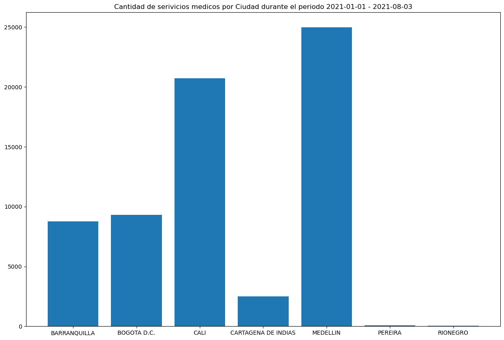
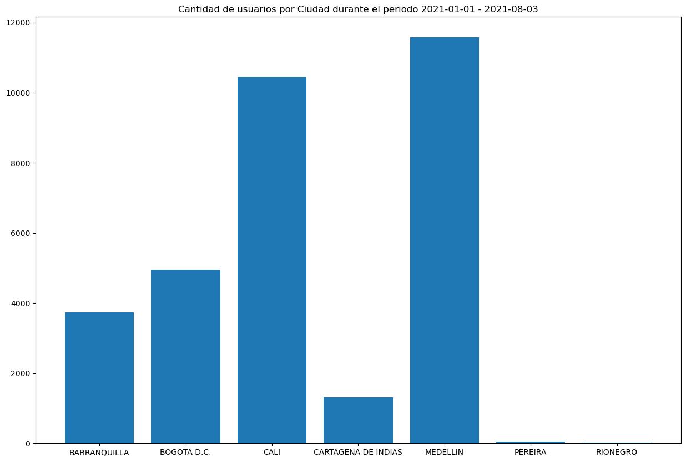
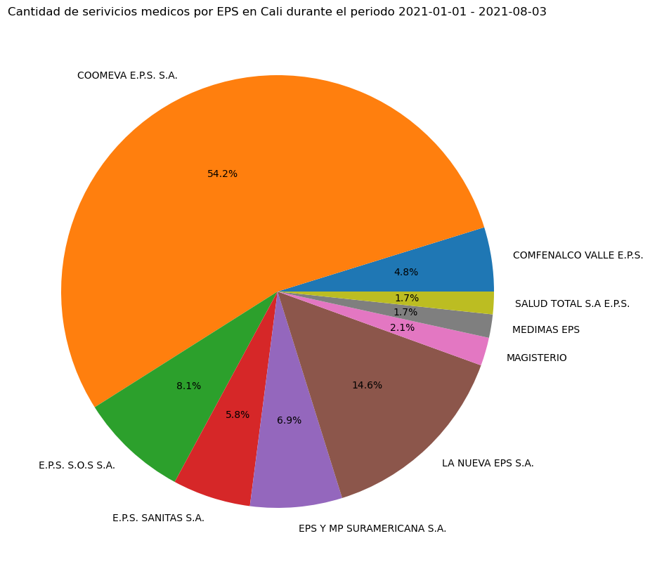
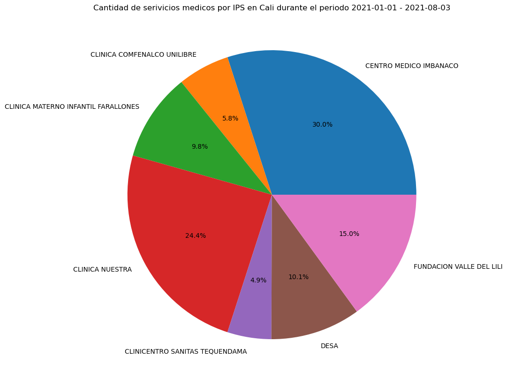

# Gestion_almacenamiento_BD
Proyecto Final Materia Gestión y Almacenamiento de Bases de Datos

# Movired Soluciones Logísticas SAS es una empresa creada desde hace poco más de un año por tres ingenieros de la Ciudad de Cali – Valle; con el objetivo de brindar una solución a la problemática del transporte que poseen las personas en condición de movilidad reducida.*

#### Movired Soluciones Logísticas SAS ha obtenido una base de datos proveniente de ********* que contiene todos los pacientes atendidos de enero a Agosto de 2021 en su operación en las ciudades de Cali, Medellín, Bogotá, Barranquilla y Cartagena.

- El objetivo del análisis de la base de datos de las atenciones de ********* es identificar principalmente en la ciudad de Cali usuarios potenciales que pueden estar interesados en el servicio de transporte ofrecido por Movired Soluciones Logísticas; entre estos posibles usuarios se requiere determinar y seleccionar las personas que se encuentran en condición de movilidad reducida o que podrían requerir para su movilización un transporte especial sin estar propiamente en condición de movilidad reducida debido a temas de comodidad por su condición de salud o edad avanzada.

- Así mismo se plantea identificar otro tipo de poblaciones a las que se pueda extender el servicio especial de transporte de pasajeros; tales como personas que frecuentemente en la semana y/o en el mes requieren de desplazarse a centros médicos como hospitales y centros de rehabilitación; que no necesariamente se encuentran en condición de movilidad reducida.

- Finalmente, con miras a la expansión del servicio ofrecido por Movired en la ciudad de Cali, se requiere de un análisis pre liminar que permita identificar la próxima o próximas ciudades donde el servicio ofrecido sea ampliamente recibido; en función de la cantidad de usuarios potenciales que podrían estar interesados en el mismo.

### Analisis DataSet:

Se obtuvo una base de datos que contiene 66370 registros con 104 atributos (columnas); de estos 104 atributos se seleccionaron inicialmente 15 que se presumian contenián información relevante para el estudio:

- MUNICIPIO                     object
- NOMBRE                        object
- DOCUMENTO                      int64
- EDAD                           int64
- FECHA_NACIMIENTO              object
- GENERO                        object
- DIRECCION                     object
- BARRIO                        object
- TELEFONO                       int64
- CELULAR                        int64
- FECHA_LLAMADA         datetime64[ns]
- TIPO_ATENCION                 object
- TARJETA_DESPACHO              object
- OBSERVACIONES                 object
- COD_DIAGNOSTICO               object
- DESC_DIAGNOSTICO              object
- COD_PROCEDIMIENTO             object
- DESC_PROCEDIMIENTO            object
- TIPO_VEHICULO                 object
- EPS                           object
- IPS                           object

Seguidamente se analizo la cantidad de servicios prestados por ciudad, evidenciando mas de 20 mil servicios prestados en la ciudad de Cali y cerca de 25 mil en la ciduad de Medellin como las ciudades con mas servicios prestados:

Al realizar el analisis por ciudad de la cantidad de distintos pacientes atendidos; se obervo que en Cali se atendieron a mas de 10 mil pacientes:

Centrandonse ya en el analisis de la información de los servicios prestados en la ciudad de Cali se busco identificar las EPS e IPS con mayores traslados y atenciones de pacientes:

Aunque actualmente Coomeva EPS no existe mas, SOS, Sanitas, Suramericana y Nueva EPS siguen siendo grandes opciones para ofrecer convenios de transportes de sus pacientes afiliados.

De la misma manera se propondrá campañas de decuentos en los traslados, para los usuarios particulares, que se dirigan hacia los centros medicos IMBANACO, CLINICA NUESTRA, FUNDACIÓN VALLE DEL LILI, DESA y FARALLONES.

Se realizo un analisis de tipo histograma relacionando la cantidad de servicios (eje X) con la cantidad de pacientes distintos (eje Y) 

Se observa entonces que mas de 9500 pacientes distintos hicieron uso de los servicios entre 1 y 5 veces durante los primeros 8 meses del 2021; por lo tanto serán de nuestro interes los restantes que son alrededor de 500 pacientes distintos.

A estos últimos se realizo un analisis de frecuencia de servicios mensaules y se seleccionaron 421 posibles usuarios que hicieron uso de los servicios en al menos 3 veces durante 1 mes; seguidamente se realizo un trabajo de limpieza de datos de contacto; obtenido una base de 941 con números de celular y números de telefono fijos.

Esta base será un insumo inicial para Movired Soluciones Logisticas con la cúal se espera aumentar el número de usuarios que hacen uso del servicio de transporte especializado que se oferta.

